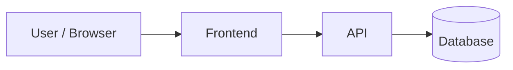
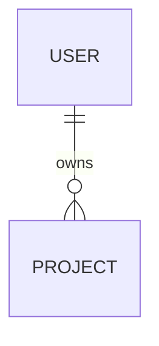

# Architecture

How the system is built: the big pieces, where they live, how they talk, and the rules that keep them consistent. Use this with `PRODUCT.md` (what we're building) and `DESIGN.md` (how it looks).

Keep this short and stable. Describe things that rarely change. Name important files, modules, and types, but don't link to exact lines, since those go stale.

## Overview

- **What the system does (one paragraph):**
- **Architecture style:** (e.g. Next.js monolith, API + SPA, serverless, monorepo with packages)
- **Main users of the system:** (browser, mobile app, other services, cron jobs)

## Stack

| Layer | Choice | Version |
|-------|--------|---------|
| Language | | |
| Frontend | | |
| Backend / API | | |
| Database | | |
| Auth | | |
| Hosting / deploy | | |
| Testing | | |

## System Diagram



## Codemap

Where things live, and what each part is responsible for. Answer "where's the code that does X?"

```text
/
├── src/
│   ├── app/          # routes and pages
│   ├── components/   # UI components
│   ├── lib/          # shared helpers
│   └── server/       # API handlers and business logic
└── tests/
```

| Area | Lives in | Responsible for | Must not |
|------|----------|-----------------|----------|
| | | | |

## Data Model

Main entities and how they relate. Names and relationships only; the schema files hold the details.



## Key Flows

How a request or action moves through the system, for the 2–4 flows that matter most (e.g. sign up, checkout, sync).

### Flow 1:

1.
2.
3.

## Architecture Decisions

Decisions a new contributor couldn't guess from the code. Add one entry per decision; never renumber.

### AD-1:

- **Decision:**
- **Why:**
- **Alternatives rejected:**

## Rules

Constraints every change must follow, so different sessions and contributors don't drift.

- **Dependency direction:** (e.g. `components` may import from `lib`, never from `server`)
- **Data access:** (e.g. only `server/` talks to the database)
- **Errors:** (shape of errors, where they're caught)
- **Naming:** (files, components, database tables, API routes)

## Cross-Cutting Concerns

- **Auth and permissions:**
- **Validation:**
- **Logging and monitoring:**
- **Configuration and secrets:** (env vars, where they're defined; never commit values)
- **Performance:**
- **Security:**

## Environments and Deployment

| Environment | URL | Deploys from | Notes |
|-------------|-----|--------------|-------|
| Local | | | |
| Preview | | | |
| Production | | | |

## Deferred

Decisions intentionally left for later, and why they can wait.

-
